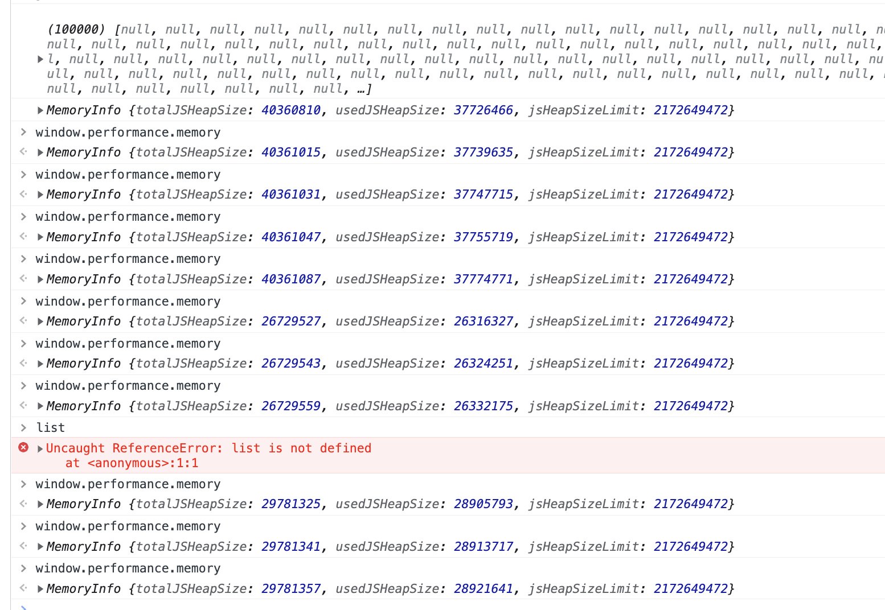

## 介绍

WebAssembly （wasm）是一种新的编码方式，可以在现代的网络浏览器中运行 － 它是一种低级的类汇编语言，具有紧凑的二进制格式，可以接近原生的性能运行，并为诸如 C / C ++等语言提供一个编译目标，以便它们可以在 Web 上运行。它也被设计为可以与 JavaScript 共存，允许两者一起工作。 [MDN WebAssembly](https://developer.mozilla.org/zh-CN/docs/WebAssembly)

## js/webAssembly工作方式

​	

js 即时编译流程

wasm 流程

## 优点

- 提取wasm所需的时间更少，因为即使压缩后，它也比JavaScript更紧凑。
- 解码wasm所需的时间少于解析JavaScript所需的时间。
  - 编译和优化所需的时间更少
  - wasm比JavaScript更接近机器代码，并且已经在服务器端进行了优化。
  - 不需要进行重新优化，因为wasm内置了类型和其他信息，因此JS引擎在优化JavaScript方式时无需推测。
  - 由于内存是手动管理的，因此不需要垃圾回收
- 执行通常会花费较少的时间，因为开发人员在编写一致的高性能代码时需要知道的编译器技巧和陷阱就更少了，另外wasm的指令集更适合机器。
- 后端可以提供模块，实现一部分功能

## 使用

go 版本 -- go1.19.2

chrome 版本 -- 105.0.5195.125（正式版本） (x86_64)

[demo](http://127.0.0.1:8000)

## 分析

实际运行结果，js比wasm表现好

+ 大小上，同等作用的代码。wasm大小1.4M，js大小705B

+ 速度上，同等作用的代码。wasm运行速度比js慢

+ 内存上，垃圾无法回收会导致内存占用大！如下：
  

  	

  		
  		
wasm 产生垃圾后一段时间后的内存占用情况

  	

  		
  		
js 产生垃圾后一段时间后的内存占用情况

  	

  

  
  
  

## 相关链接

[go webassembly 文档 -- github.com](https://github.com/golang/go/wiki/WebAssembly)

[syscall/js 官方文档 -- golang.org](https://pkg.go.dev/syscall/js)